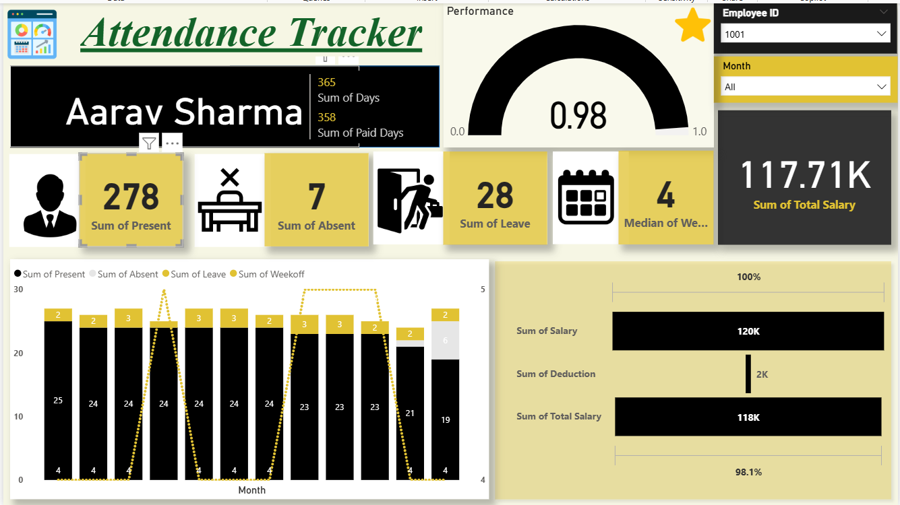

# Automated Attendance Tracking System (Power BI)

An end-to-end HR analytics capstone project that transforms raw daily attendance data into automated payroll calculations and an interactive Power BI dashboard for attendance monitoring and decision-making.



## Problem Statement

Manual and semi-automated attendance systems suffer from several limitations:
- Inaccurate and inconsistent data
- Difficulty tracking attendance trends over time
- Time-consuming report generation
- No centralized, visual monitoring system
- Limited insights for management and administrators

This project builds a Power BI–based automated system that converts raw attendance data into interactive dashboards and actionable insights.

## Objectives

- Automate attendance analysis using Power BI
- Visualize daily, monthly, and yearly attendance
- Identify absenteeism trends
- Reduce manual reporting effort
- Support administrative and managerial decision-making

## Dataset

- Self-created dataset simulating **20 employees** across **12 months** of daily attendance (Present / Absent / Leave / Week-off)
- Key fields: Employee ID, Name, Date, Attendance Status, Performance, Salary

## Methodology

1. **Data Collection** — attendance data collected in Excel format containing employee details, dates, and daily attendance status.
2. **Data Cleaning (Power Query)** — removed duplicates and null values, standardized formats, created attendance status columns (present/absent/late).
3. **Data Modeling** — established relationships between date, department, and user tables; optimized the model for reporting.
4. **DAX Measures** — built calculated measures including Total Count, Present Count, Absent Count, Attendance Percentage, and Late Attendance Count.
5. **Payroll Automation** — calculated per-day salary rate and automated salary deductions based on paid days vs. total working days per employee, per month.
6. **Dashboard Development** — built interactive visuals with slicers and filters for Employee ID and Month.

## Dashboard Design

- **Header** — employee name, total working days, total paid days
- **Performance Gauge** — attendance efficiency score (e.g., 0.98)
- **KPI Cards** — total present days, absent days, leave days, median week-offs
- **Monthly Attendance Chart** — present/absent/leave/week-off trends across months
- **Salary Analysis** — total salary, deductions, and net payable salary with efficiency %
- **Slicers** — dynamic filtering by Employee ID and Month

## Key Insights

- Attendance percentage fluctuates during specific periods of the year
- Late arrivals cluster on particular days
- Overall attendance performance can be monitored in real time via the dashboard

## Tech Stack

Power BI, Power Query, DAX, Microsoft Excel

## Repository Structure

```
attendance-payroll-dashboard/
├── data/
│   ├── Main_Attendance_Data_Sheet.xlsx     # raw daily attendance, Jan–Dec
│   └── Yearly_Report.xlsx                  # consolidated yearly payroll report
├── dashboard/
│   └── Attendance_Tracker.pbix             # Power BI dashboard file
├── docs/
│   ├── CP1_Project_Proposal.pdf
│   └── CP1_Report.pdf                      # full project report
├── presentation/
│   └── Automated_Attendance_PowerBI_Presentation.pptx
├── screenshots/
│   └── Dashboard_screenshot.png
└── README.md
```

## Challenges Faced

- Handling inconsistent raw attendance data
- Creating accurate DAX measures
- Designing a user-friendly, intuitive dashboard layout
- Ensuring data accuracy on refresh

## Real-Life Applications

- Student attendance monitoring in colleges
- Employee attendance tracking in companies
- HR and performance analysis
- Compliance and audit reporting

## Future Scope

- Integration with biometric or face recognition systems
- Real-time database connectivity
- Mobile-friendly dashboards
- Predictive analysis for absenteeism
- Cloud deployment via Power BI Service

## Note

This dataset was self-created for the purpose of this capstone project (not live company data), designed to realistically represent a company's attendance-to-payroll workflow.

## References

- Microsoft Power BI Documentation
- Data Analytics and BI Learning Resources
